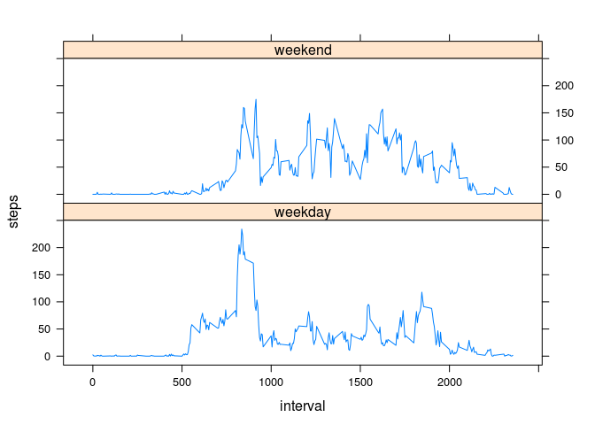

# Reproducible Research: Peer Assessment 1


## Loading and preprocessing the data

```r
data<-read.csv('activity.csv')
data$date=as.Date(data$date)
```

## What is mean total number of steps taken per day?

```r
daily_steps<-aggregate(data$steps,list(data$date),sum)
names(daily_steps)=c('date','steps')
daily_mean_steps=mean(daily_steps$steps,na.rm=T)
daily_median_steps=median(daily_steps$steps,na.rm=T)
hist(daily_steps$steps,main='histogram of the total number of steps taken each day',xlab='steps')
```

 

The mean and median total number of steps taken per day are 1.0766189\times 10^{4} and 10765.


## What is the average daily activity pattern?

```r
average_interval_steps<-aggregate(data$steps,list(data$interval),mean,na.rm=T)
names(average_interval_steps)=c('interval','steps')
plot(average_interval_steps,type='l',main='average steps within interval')
```

 

```r
max_interval=average_interval_steps$interval[which.max(average_interval_steps$steps)]
```

The 835 interval on average across all the days in the dataset, contains the maximum number of steps.

## Imputing missing values

```r
num_na=sum(is.na(data$steps))
```

Total number of NAs is 2304.  

Fill in NA values using 5-min interval average.  

```r
data1=data
for (i in 1:nrow(data1)){
  if (is.na(data1[i,'steps'])){
    data1[i,'steps']=average_interval_steps$steps[which(average_interval_steps$interval==data1[i,'interval'])]
  }
}
daily_steps1<-aggregate(data1$steps,list(data1$date),sum)
names(daily_steps1)=c('date','steps')
daily_mean_steps1=mean(daily_steps1$steps,na.rm=T)
daily_median_steps1=median(daily_steps1$steps,na.rm=T)
hist(daily_steps1$steps,main='histogram of the total number of steps taken each day, NAs are filled',xlab='steps')
```

 

Now, the mean and median total number of steps taken per day are 1.0766189\times 10^{4} and 1.0766189\times 10^{4}.  
They differ from the results in part1.  
The mean and median become the same.  


## Are there differences in activity patterns between weekdays and weekends?

```r
data$weekday=as.numeric(strftime(data$date,'%u'))
is_weekday = (data$weekday <=5)
data$weekday[is_weekday]='weekday'
data$weekday[!is_weekday]='weekend'
data$weekday=as.factor(data$weekday)
week_data=aggregate(data$steps,list(data$weekday,data$interval),mean,na.rm=T)
names(week_data)=c('weekday','interval','steps')
library(lattice)
xyplot(steps~interval|weekday,week_data,layout = c(1,2),type='l')
```

 


